# Task Mermaid Examples

Полная коллекция примеров диаграмм и графиков Mermaid.

---

## 1. Блок-схема (Flowchart)

### 1.1 Простая блок-схема

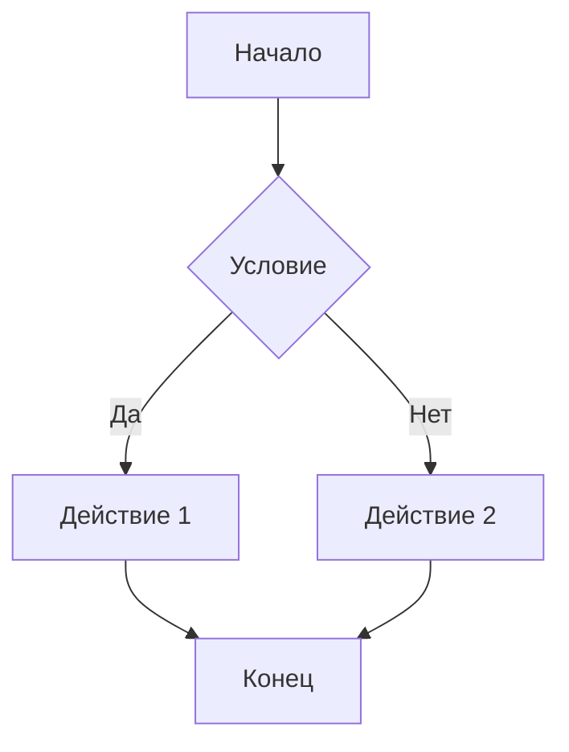
```mermaid
flowchart TD
    A[Начало] --> B{Условие}
    B -->|Да| C[Действие 1]
    B -->|Нет| D[Действие 2]
    C --> E[Конец]
    D --> E
```

### 1.2 Блок-схема с разными формами

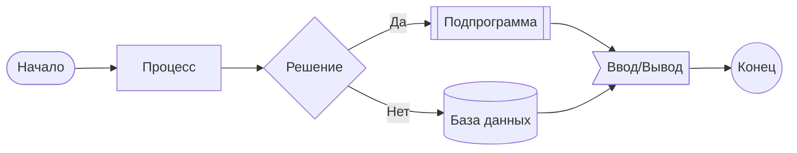
```mermaid
flowchart LR
    A([Начало]) --> B[Процесс]
    B --> C{Решение}
    C -->|Да| D[[Подпрограмма]]
    C -->|Нет| E[(База данных)]
    D --> F>Ввод/Вывод]
    E --> F
    F --> G((Конец))
```

### 1.3 Вертикальная блок-схема

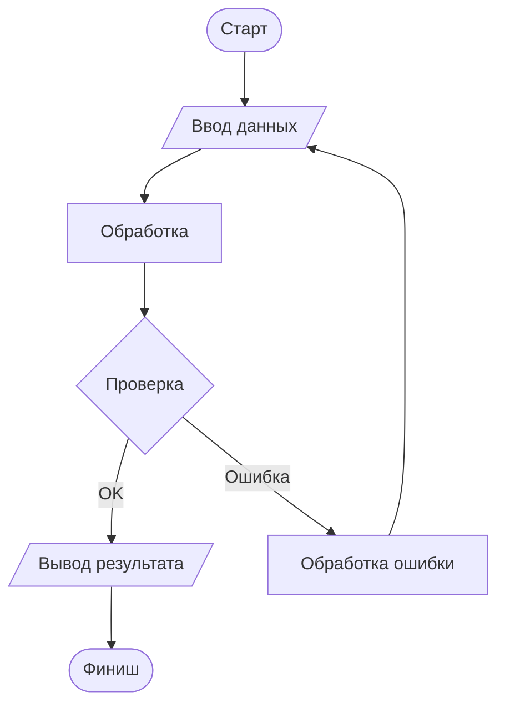
```mermaid
flowchart TB
    Start([Старт]) --> Input[/Ввод данных/]
    Input --> Process[Обработка]
    Process --> Check{Проверка}
    Check -->|OK| Output[/Вывод результата/]
    Check -->|Ошибка| Error[Обработка ошибки]
    Error --> Input
    Output --> End([Финиш])
```

### 1.4 Блок-схема с подграфами

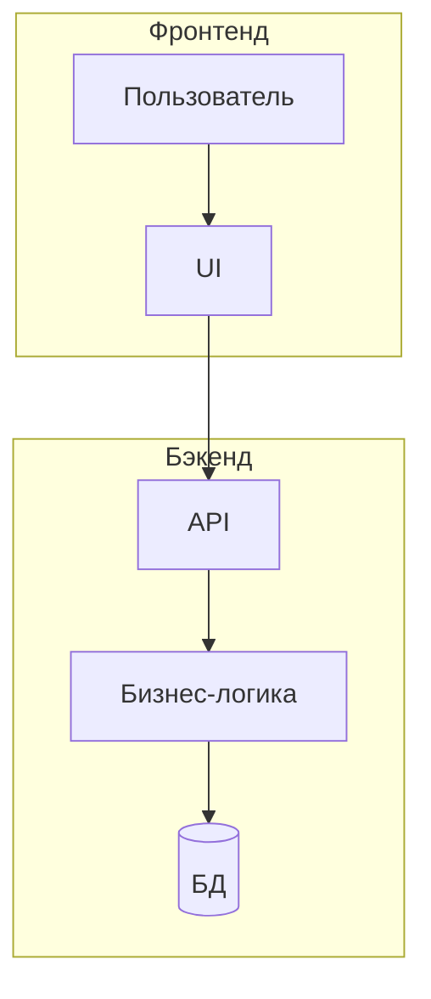
```mermaid
flowchart TD
    subgraph Frontend[Фронтенд]
        A[Пользователь] --> B[UI]
    end
    subgraph Backend[Бэкенд]
        C[API] --> D[Бизнес-логика]
        D --> E[(БД)]
    end
    B --> C
```

### 1.5 Горизонтальная блок-схема со стилями

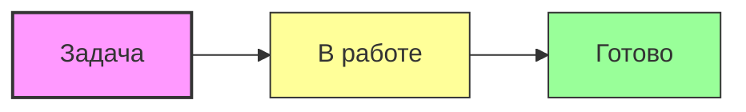
```mermaid
flowchart LR
    A[Задача] --> B[В работе]
    B --> C[Готово]
    style A fill:#f9f,stroke:#333,stroke-width:2px
    style B fill:#ff9,stroke:#333
    style C fill:#9f9,stroke:#333
```

---

## 2. Диаграмма последовательности (Sequence Diagram)

### 2.1 Базовая диаграмма

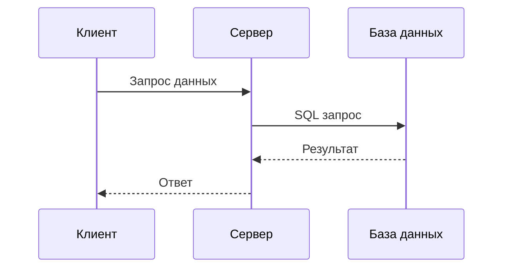
```mermaid
sequenceDiagram
    participant A as Клиент
    participant B as Сервер
    participant C as База данных
    A->>B: Запрос данных
    B->>C: SQL запрос
    C-->>B: Результат
    B-->>A: Ответ
```

### 2.2 С активацией и заметками

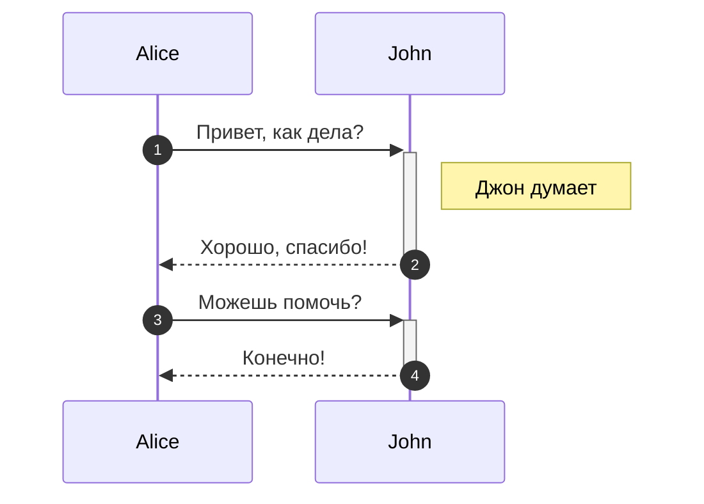
```mermaid
sequenceDiagram
    autonumber
    Alice->>+John: Привет, как дела?
    Note right of John: Джон думает
    John-->>-Alice: Хорошо, спасибо!
    Alice->>+John: Можешь помочь?
    John-->>-Alice: Конечно!
```

### 2.3 С альтернативами и циклами

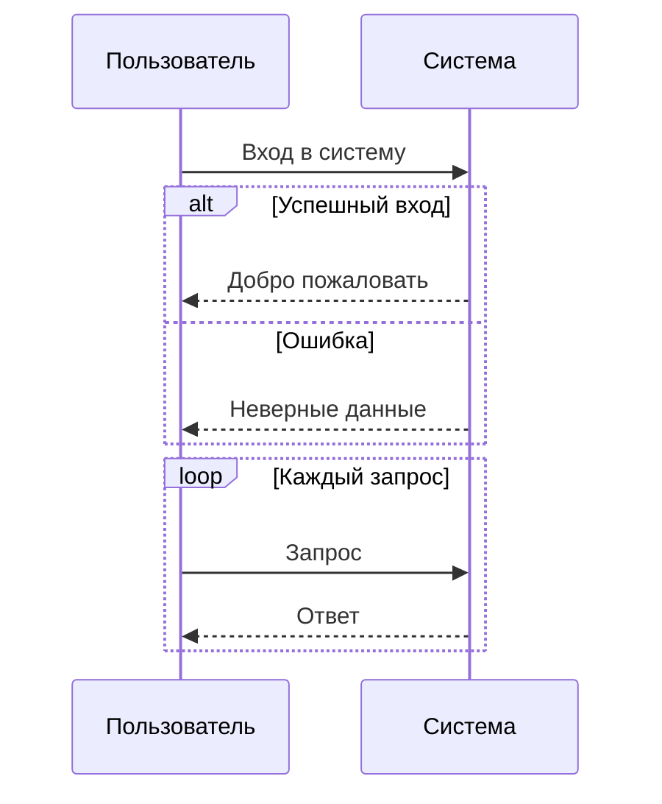
```mermaid
sequenceDiagram
    participant U as Пользователь
    participant S as Система
    U->>S: Вход в систему
    alt Успешный вход
        S-->>U: Добро пожаловать
    else Ошибка
        S-->>U: Неверные данные
    end
    loop Каждый запрос
        U->>S: Запрос
        S-->>U: Ответ
    end
```

### 2.4 С параллельными действиями

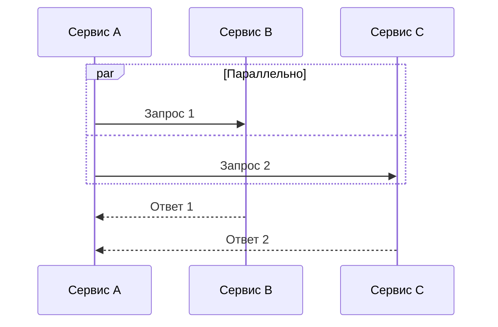
```mermaid
sequenceDiagram
    participant A as Сервис A
    participant B as Сервис B
    participant C as Сервис C
    par Параллельно
        A->>B: Запрос 1
    and
        A->>C: Запрос 2
    end
    B-->>A: Ответ 1
    C-->>A: Ответ 2
```

---

## 3. Диаграмма классов (Class Diagram)

### 3.1 Базовая диаграмма классов

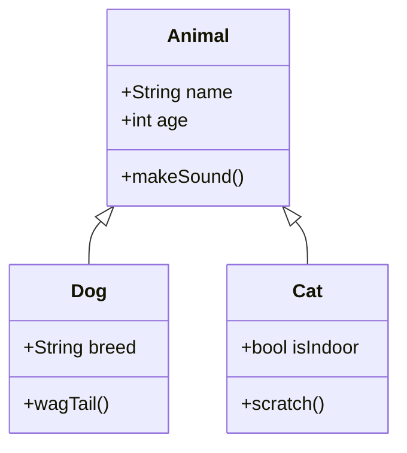
```mermaid
classDiagram
    class Animal {
        +String name
        +int age
        +makeSound()
    }
    class Dog {
        +String breed
        +wagTail()
    }
    class Cat {
        +bool isIndoor
        +scratch()
    }
    Animal <|-- Dog
    Animal <|-- Cat
```

### 3.2 С отношениями

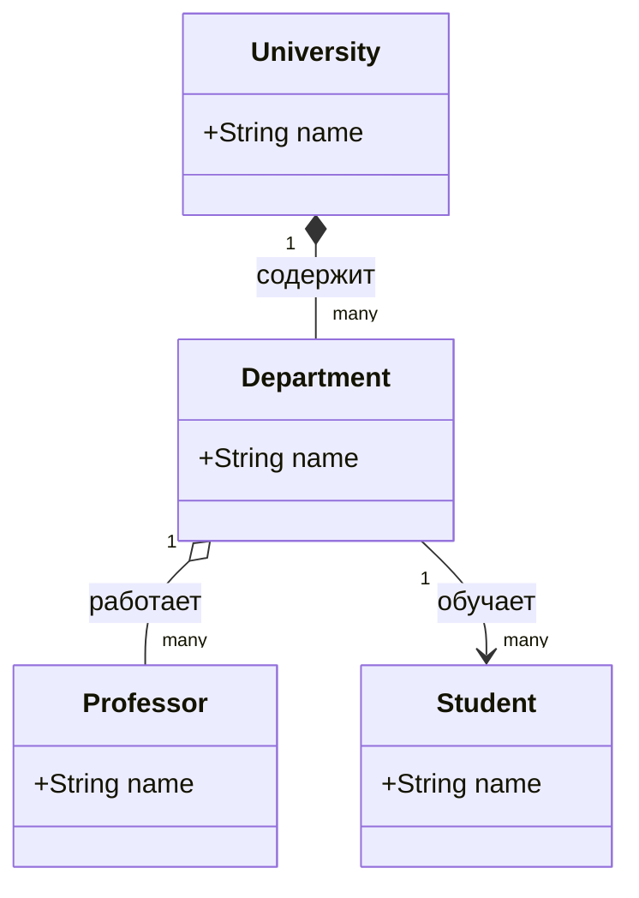
```mermaid
classDiagram
    class University {
        +String name
    }
    class Department {
        +String name
    }
    class Professor {
        +String name
    }
    class Student {
        +String name
    }
    University "1" *-- "many" Department : содержит
    Department "1" o-- "many" Professor : работает
    Department "1" --> "many" Student : обучает
```

### 3.3 С интерфейсами и абстракциями

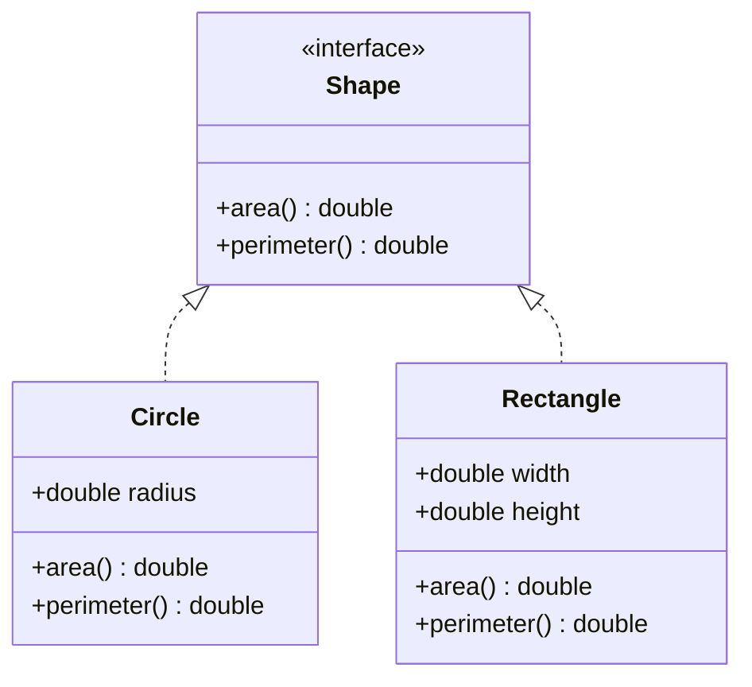
```mermaid
classDiagram
    class Shape {
        <<interface>>
        +area() double
        +perimeter() double
    }
    class Circle {
        +double radius
        +area() double
        +perimeter() double
    }
    class Rectangle {
        +double width
        +double height
        +area() double
        +perimeter() double
    }
    Shape <|.. Circle
    Shape <|.. Rectangle
```

---

## 4. Диаграмма состояний (State Diagram)

### 4.1 Простая диаграмма состояний

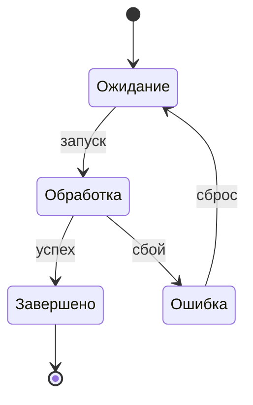
```mermaid
stateDiagram-v2
    [*] --> Ожидание
    Ожидание --> Обработка : запуск
    Обработка --> Завершено : успех
    Обработка --> Ошибка : сбой
    Ошибка --> Ожидание : сброс
    Завершено --> [*]
```

### 4.2 С составными состояниями

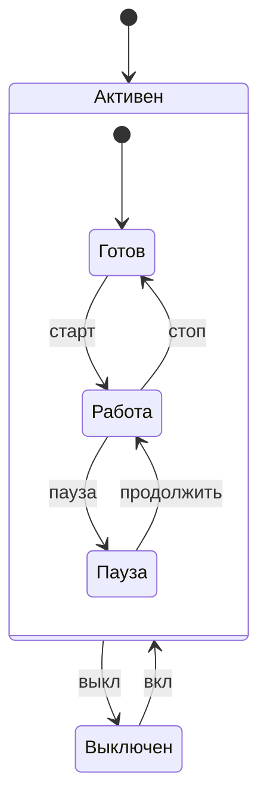
```mermaid
stateDiagram-v2
    [*] --> Активен
    state Активен {
        [*] --> Готов
        Готов --> Работа : старт
        Работа --> Пауза : пауза
        Пауза --> Работа : продолжить
        Работа --> Готов : стоп
    }
    Активен --> Выключен : выкл
    Выключен --> Активен : вкл
```

### 4.3 С параллельными состояниями

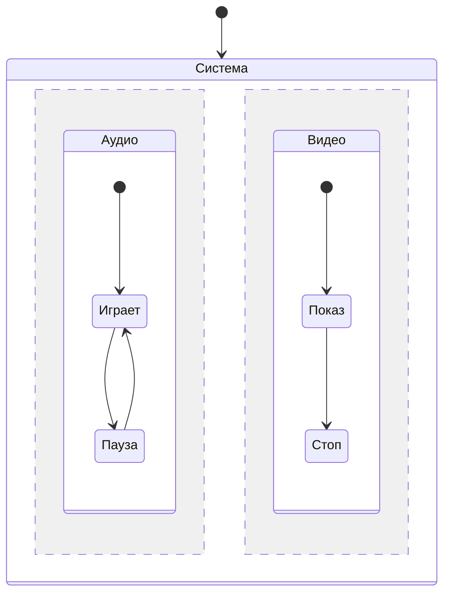
```mermaid
stateDiagram-v2
    [*] --> Система
    state Система {
        state "Аудио" as A {
            [*] --> Играет
            Играет --> Пауза
            Пауза --> Играет
        }
        --
        state "Видео" as V {
            [*] --> Показ
            Показ --> Стоп
        }
    }
```

---

## 5. ER-диаграмма (Entity Relationship)

### 5.1 Базовая ER-диаграмма

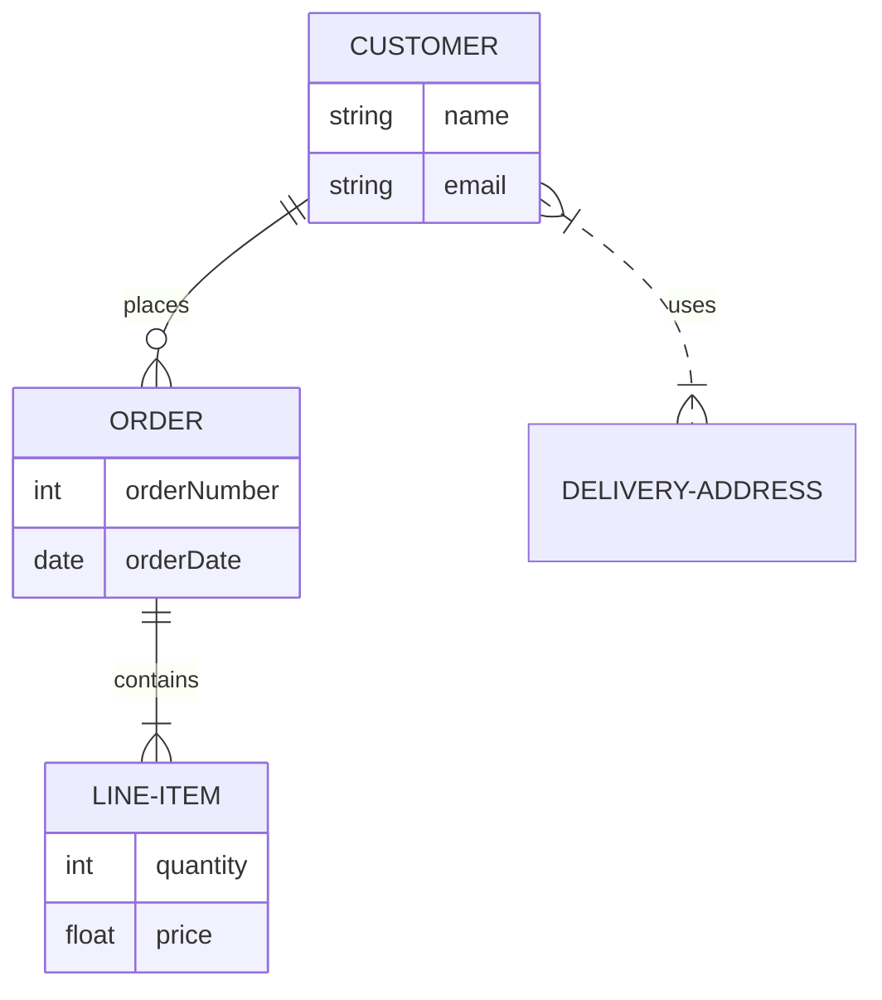
```mermaid
erDiagram
    CUSTOMER ||--o{ ORDER : places
    ORDER ||--|{ LINE-ITEM : contains
    CUSTOMER }|..|{ DELIVERY-ADDRESS : uses
    CUSTOMER {
        string name
        string email
    }
    ORDER {
        int orderNumber
        date orderDate
    }
    LINE-ITEM {
        int quantity
        float price
    }
```

### 5.2 С множественными связями

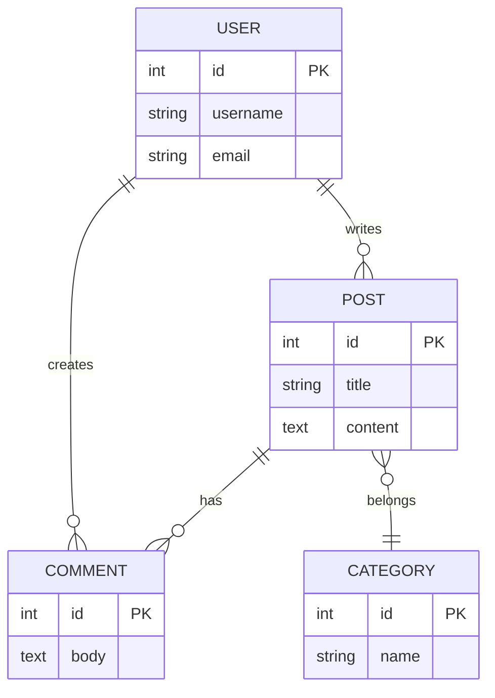
```mermaid
erDiagram
    USER ||--o{ POST : writes
    USER ||--o{ COMMENT : creates
    POST ||--o{ COMMENT : has
    POST }o--|| CATEGORY : belongs
    USER {
        int id PK
        string username
        string email
    }
    POST {
        int id PK
        string title
        text content
    }
    COMMENT {
        int id PK
        text body
    }
    CATEGORY {
        int id PK
        string name
    }
```

---

## 6. Диаграмма Ганта (Gantt Chart)

### 6.1 Простая диаграмма Ганта

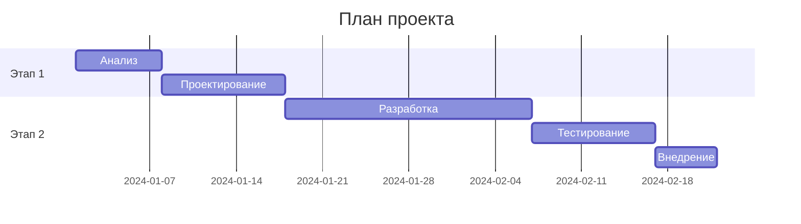
```mermaid
gantt
    title План проекта
    dateFormat YYYY-MM-DD
    section Этап 1
    Анализ           :a1, 2024-01-01, 7d
    Проектирование   :a2, after a1, 10d
    section Этап 2
    Разработка       :a3, after a2, 20d
    Тестирование     :a4, after a3, 10d
    Внедрение        :a5, after a4, 5d
```

### 6.2 С зависимостями и вехами

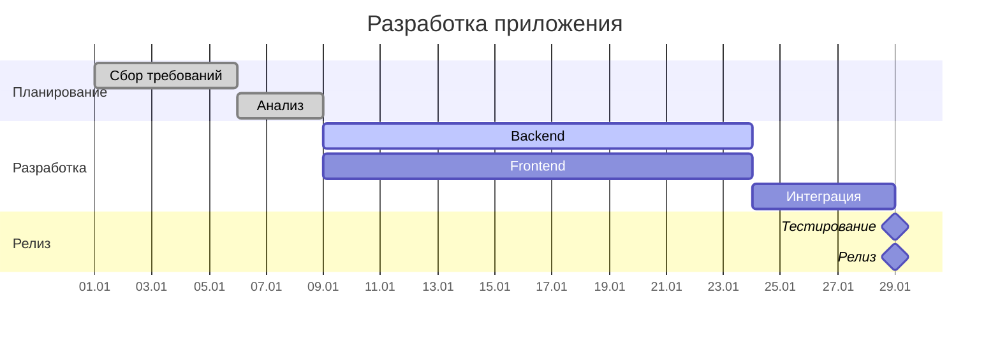
```mermaid
gantt
    title Разработка приложения
    dateFormat YYYY-MM-DD
    axisFormat %d.%m
    section Планирование
    Сбор требований      :done, p1, 2024-01-01, 5d
    Анализ               :done, p2, after p1, 3d
    section Разработка
    Backend              :active, d1, after p2, 15d
    Frontend             :d2, after p2, 15d
    Интеграция           :d3, after d1, 5d
    section Релиз
    Тестирование         :milestone, m1, after d3, 0d
    Релиз                :milestone, m2, after m1, 0d
```

### 6.3 С критическим путём

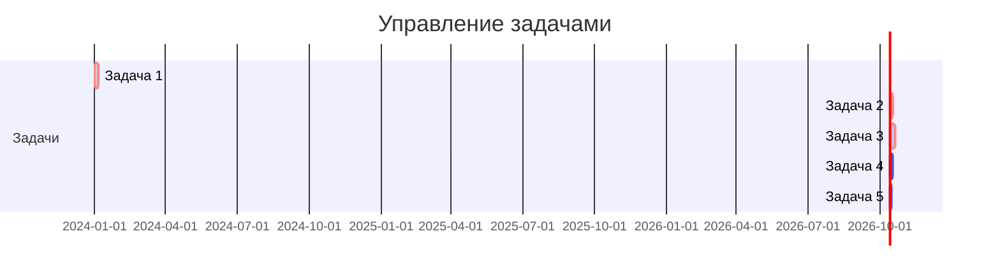
```mermaid
gantt
    title Управление задачами
    dateFormat YYYY-MM-DD
    section Задачи
    Задача 1    :crit, done, 2024-01-01, 5d
    Задача 2    :crit, done, after 1, 3d
    Задача 3    :crit, active, after 2, 7d
    Задача 4    :after 2, 4d
    Задача 5    :after 3, 2d
```

---

## 7. Круговая диаграмма (Pie Chart)

### 7.1 Простая круговая диаграмма

```mermaid
pie title Распределение времени
    "Работа" : 45
    "Сон" : 30
    "Отдых" : 15
    "Спорт" : 10
```

### 7.2 С другими данными

```mermaid
pie showData title Продажи по регионам
    "Европа" : 35.5
    "Азия" : 42.3
    "Америка" : 18.7
    "Африка" : 3.5
```

---

## 8. Диаграмма Git (Git Graph)

### 8.1 Простой git-граф

```mermaid
gitGraph
    commit
    commit
    branch develop
    checkout develop
    commit
    commit
    checkout main
    merge develop
    commit
```

### 8.2 Сложный git-граф

```mermaid
gitGraph
    commit id: "init"
    commit id: "feat-1"
    branch feature
    checkout feature
    commit id: "feat-2"
    commit id: "feat-3"
    checkout main
    commit id: "hotfix"
    merge feature tag: "v1.0"
    commit id: "release"
```

---

## 9. Диаграмма пользовательских путей (User Journey)

### 9.1 Путь пользователя

```mermaid
journey
    title Мой рабочий день
    section Утро
      Проснуться: 3: Я
      Завтрак: 4: Я
      Дорога: 2: Я
    section День
      Работа: 5: Я
      Обед: 4: Я
      Работа: 3: Я
    section Вечер
      Домой: 4: Я
      Отдых: 5: Я
```

### 9.2 С несколькими участниками

```mermaid
journey
    title Покупка в интернет-магазине
    section Поиск
      Открыть сайт: 5: Пользователь
      Найти товар: 4: Пользователь
    section Покупка
      Добавить в корзину: 3: Пользователь
      Оформить заказ: 2: Пользователь, Система
      Оплата: 1: Пользователь, Банк
    section Доставка
      Получить товар: 5: Пользователь, Курьер
```

---

## 10. Диаграмма требований (Requirement Diagram)

```mermaid
requirementDiagram

requirement test_req {
    id: 1
    text: "Система должна работать"
    risk: high
    verifymethod: test
}

functionalRequirement test_req2 {
    id: 1.1
    text: "Система должна быть быстрой"
    risk: low
    verifymethod: inspection
}

element test_entity {
    type: simulation
}

test_entity - satisfies -> test_req2
test_req - contains -> test_req2
```

---

## 11. C4-диаграмма (C4 Diagram)

### 11.1 Контекстная диаграмма

```mermaid
C4Context
    title Контекст системы
    Person(user, "Пользователь", "Использует систему")
    System(sys, "Наша система", "Делает что-то полезное")
    System_Ext(ext, "Внешняя система", "Предоставляет данные")
    Rel(user, sys, "Использует")
    Rel(sys, ext, "Запрашивает данные")
```

### 11.2 Диаграмма контейнеров

```mermaid
C4Container
    title Диаграмма контейнеров
    Person(user, "Пользователь")
    Container_Boundary(c1, "Система") {
        Container(web, "Веб-приложение", "React", "UI")
        Container(api, "API", "Node.js", "Логика")
        ContainerDb(db, "База данных", "PostgreSQL", "Хранение")
    }
    Rel(user, web, "Использует")
    Rel(web, api, "Запросы")
    Rel(api, db, "Читает/пишет")
```

---

## 12. Диаграмма блоков (Block Diagram)

```mermaid
block-beta
    columns 3
    A[Вход] B[Обработка] C[Выход]
    D[Модуль 1] E[Модуль 2] F[Модуль 3]
    A --> B
    B --> C
    D --> E
    E --> F
```

---

## 13. Диаграмма упаковки (Packet Diagram)

```mermaid
packet-beta
    0-15: "Source Port"
    16-31: "Destination Port"
    32-63: "Sequence Number"
    64-95: "Acknowledgment Number"
    96-99: "Data Offset"
    100-105: "Reserved"
    106-111: "Flags"
    112-127: "Window"
```

---

## 14. Диаграмма архитектуры (Architecture Diagram)

```mermaid
architecture-beta
    group api(cloud)[API]
    service db(database)[Database] in api
    service disk1(disk)[Storage] in api
    service disk2(disk)[Storage] in api
    service server(server)[Server] in api
    db:L -- R:server
    disk1:T -- B:server
    disk2:T -- B:db
```

---

## 15. Диаграмма временных рядов (Timeline)

```mermaid
timeline
    title История развития технологий
    section 1990-е
        1990 : WWW
        1995 : JavaScript
        1998 : Google
    section 2000-е
        2004 : Facebook
        2007 : iPhone
        2009 : Bitcoin
    section 2010-е
        2010 : iPad
        2015 : TensorFlow
        2019 : ChatGPT
```

---

## 16. Диаграмма квадратов (Quadrant Chart)

```mermaid
quadrantChart
    title Приоритизация задач
    x-axis Низкий приоритет --> Высокий приоритет
    y-axis Низкая сложность --> Высокая сложность
    quadrant-1 Сделать сейчас
    quadrant-2 Запланировать
    quadrant-3 Делегировать
    quadrant-4 Отложить
    Задача A: [0.8, 0.9]
    Задача B: [0.3, 0.7]
    Задача C: [0.6, 0.3]
    Задача D: [0.2, 0.2]
```

---

## 17. Диаграмма XY (XY Chart)

```mermaid
xychart-beta
    title "Продажи по месяцам"
    x-axis [янв, фев, мар, апр, май, июн]
    y-axis "Продажи (тыс. руб.)" 0 --> 100
    bar [20, 35, 45, 60, 75, 90]
    line [20, 35, 45, 60, 75, 90]
```

---

## 18. Диаграмма Санкей (Sankey Diagram)

```mermaid
sankey-beta

Agricultural 'waste',Bio-conversion,124.729
Bio-conversion,Liquid,0.597
Bio-conversion,Losses,26.862
Bio-conversion,Solid,280.322
Bio-conversion,Gas,81.144
Biofuel imports,Liquid,35
Biomass imports,Solid,35
Coal imports,Coal,11.606
Coal reserves,Coal,63.965
```

---

## 19. Карта ума (Mind Map)

```mermaid
mindmap
  root((Проект))
    Планирование
      Требования
      Сроки
      Бюджет
    Разработка
      Backend
        API
        БД
      Frontend
        UI
        UX
    Тестирование
      Юнит-тесты
      Интеграционные
    Релиз
      Деплой
      Документация
```

---

## 20. Диаграмма ZenUML

```mermaid
zenuml
    title Демонстрация
    Alice->Bob: Привет
    Bob->Alice: Привет!
    Alice->Bob: Как дела?
    Bob->Alice: Отлично!
```

---

## Заключение

Все примеры выше демонстрируют основные возможности Mermaid для создания:

- Блок-схем
- Диаграмм последовательностей
- Диаграмм классов
- Диаграмм состояний
- ER-диаграмм
- Диаграмм Ганта
- Круговых диаграмм
- Git-графов
- Пользовательских путей
- Диаграмм требований
- C4-диаграмм
- Блочных диаграмм
- Диаграмм упаковки
- Архитектурных диаграмм
- Временных рядов
- Квадратных диаграмм
- XY-диаграмм
- Диаграмм Санкей
- Карт ума
- ZenUML-диаграмм